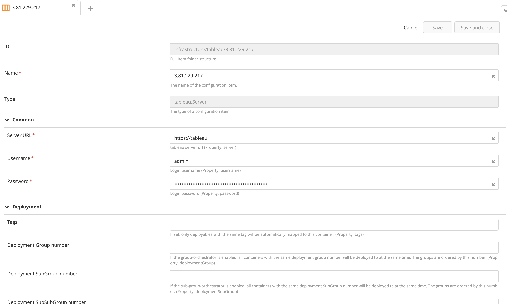
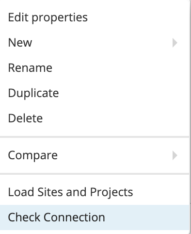
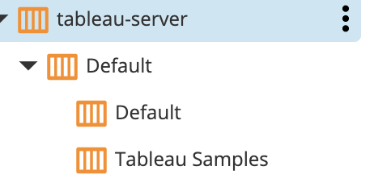
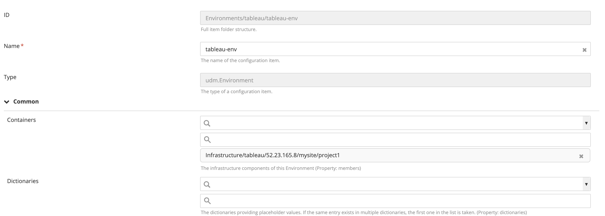
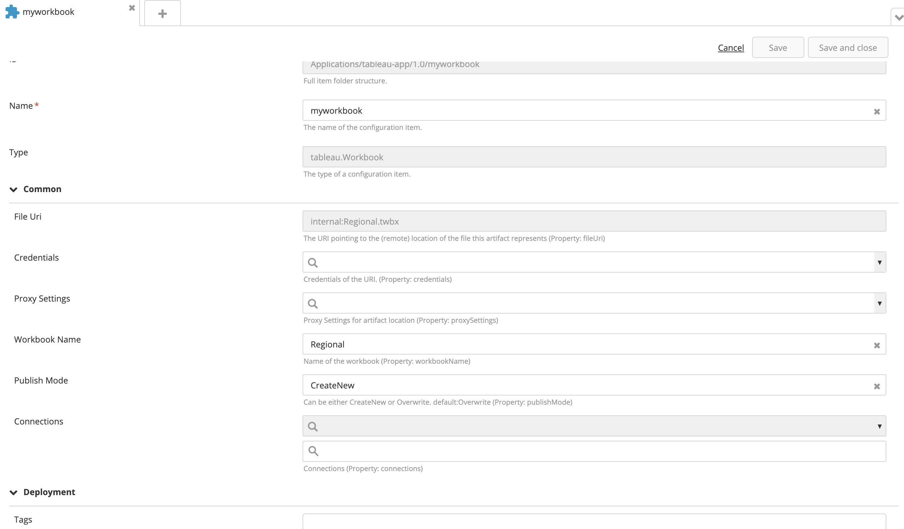
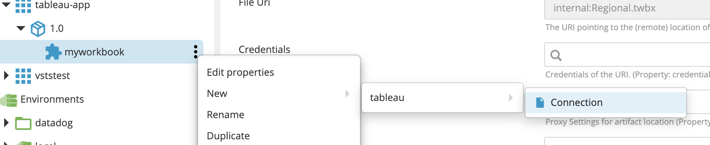
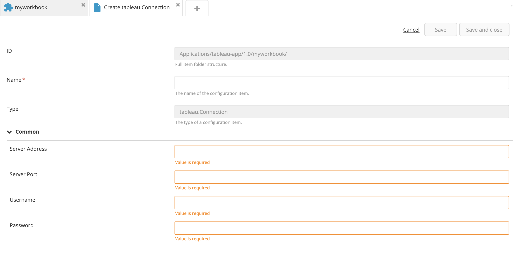
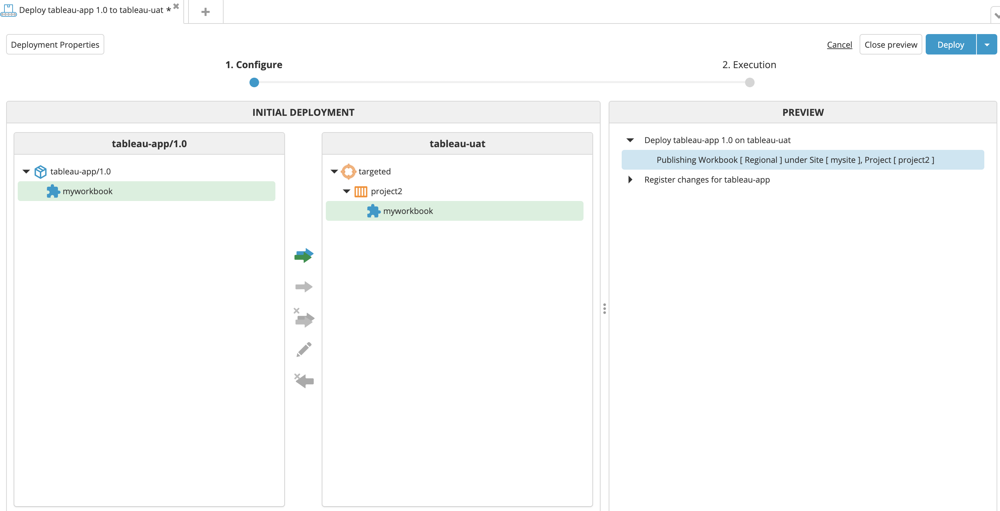

# XL Deploy Tableau Plugin

[](https://travis-ci.org/xebialabs-community/xld-tableau-plugin)
[](https://opensource.org/licenses/MIT)
[](https://github.com/xebialabs-community/xld-tableau-plugin/releases/latest)


## Preface
This document describes the functionality provided by the 'xld-tableau-plugin'

## Overview
This plugin provides capability to deploy/publish Tableau Workbooks as a part of automated deployment.  
The plugin code uses the Tableau Python client library [https://github.com/tableau/server-client-python](https://github.com/tableau/server-client-python)

## Installation
- Download the latest plugin JAR from under the **releases** section in github repository **OR** Clone the repository and run ```./gradlew build``` to build the JAR file with the latest code.
- Copy the plugin JAR fole into the *'SERVER_HOME/plugins'* directory of XL Release.

## Infrastructure 
Here's how you can provide information to connnect to a tableau instance.  

### Required Fields

- **Name:** Name of the Tableau server defintion.
- **Server URL:** URL For connecting to the server endpoint
- **User name:** OPTIONAL Name to use in notifications.
- **Password:** OPTIONAL Password



### CheckConnection
The server configuration supports **checkConnection** that allows to verify the connectivity to the target server

### Discovery
The server configuration also supports discovery of sites and projectst that will be created under the configuration itself and can be then added to Environment for deployment of workbooks.





The Hierarchy of Site and projects looks something like this.



## Environment

Add the Tableau Project under sites to map in the environment as workbooks are going to map directly on project




## Application Package

The Application package will contain a new file type artifact ( **tableau.Workbook** ) that will be used to provide a *.twbx tableau workbook file along with information about Workbook Name, Publish Mode and Connections.



The Connections referred under the **tableau.Workbook** is a nested configuration of type **tableau.Connection** that can be created under the Workbook. 

#### Create a new connection


#### Connection configuration screen


#### Deployment preview


## References
* Tableau Python client library [https://github.com/tableau/server-client-python](https://github.com/tableau/server-client-python)
